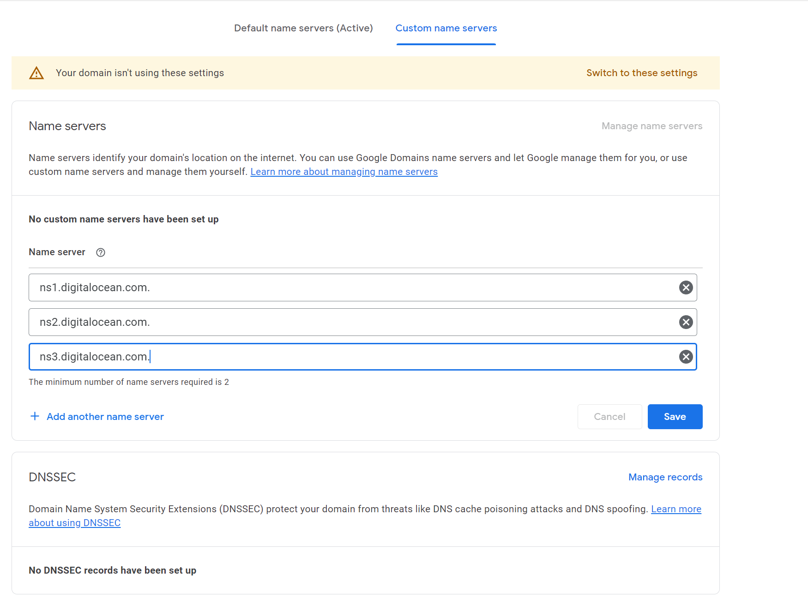
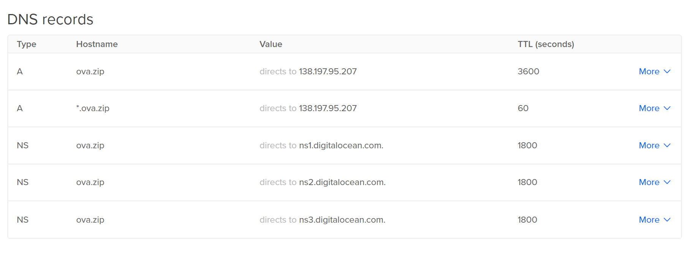

# Setup analytics on all subdomains and pages

## Domain
1. Buy Domain
2. ???

## Website
Digital Ocean droplet since cheap and easy
Create new project, create new droplet assigned to project


### Droplet setup
```
apt update && apt upgrade && reboot

# if you want additional metrics collected from your droplet
curl -sSL https://repos.insights.digitalocean.com/install.sh | sudo bash

apt install -y nginx python3-certbot-dns-digitalocean

rm /etc/nginx/sites-enabled/default

mkdir -p /var/www/html/ova.zip
nano /etc/nginx/sites-enabled/ova.zip
```

### Nginx domain configuration
`sed -i 's/ova.zip/1.zip/g'` if you want to quickly change the domain

```
server {
        listen 80 default_server;
        server_name ova.zip;

        location / {
                return 301 https://$host$request_uri;
        }
}

server {
        listen 443 ssl http2 default_server;

        root /var/www/html/ova.zip;

        server_name ova.zip;

        index index.html;

        ssl_certificate /etc/letsencrypt/live/ova.zip/fullchain.pem;
        ssl_certificate_key /etc/letsencrypt/live/ova.zip/privkey.pem;
        ssl_session_timeout 1d;
        ssl_session_cache shared:MozSSL:10m;  # about 40000 sessions
        ssl_session_tickets off;

        # modern configuration
        ssl_protocols TLSv1.3;
        ssl_prefer_server_ciphers off;

        # HSTS (ngx_http_headers_module is required) (63072000 seconds)
        add_header Strict-Transport-Security "max-age=63072000" always;

        # OCSP stapling
        ssl_stapling on;
        ssl_stapling_verify on;

        # verify chain of trust of OCSP response using Root CA and Intermediate certs
        ssl_trusted_certificate /etc/letsencrypt/live/ova.zip/chain.pem;

        access_log  /var/log/nginx/ova.zip.access.log;
        error_log   /var/log/nginx/ova.zip.error.log;

        location / {
                try_files $uri /index.html;
                sub_filter '</head>' '<title>$request_uri</title></head>';
                sub_filter_once on;
        }
}
```

Edit the `index.html` file for this domain
```
nano /var/www/html/ova.zip/index.html
```

### HTML from Google Analytics 
Paste in the copied script from Google Analytics Tag
```
<head>
<!-- Google tag (gtag.js) -->
<script async src="https://www.googletagmanager.com/gtag/js?id=G-XXXXXXXXXX"></script>
<script>
  window.dataLayer = window.dataLayer || [];
  function gtag(){dataLayer.push(arguments);}
  gtag('js', new Date());

  gtag('config', 'G-XXXXXXXXXX');
</script>
</head>
```

Enable and start the nginx service
```
systemctl enable nginx
systemctl start nginx
```


## Digital Ocean DNS

### Resources and command for SSL cert
https://www.digitalocean.com/community/tutorials/how-to-create-let-s-encrypt-wildcard-certificates-with-certbot
```
echo 'dns_digitalocean_token = $APIKEY' > ~/certbot-creds.ini && chmod 600 ~/certbot-creds.ini

sudo certbot certonly --dns-digitalocean --dns-digitalocean-credentials ~/certbot-creds.ini -d '*.ova.zip,ova.zip'
```
https://eff-certbot.readthedocs.io/en/stable/using.html#setting-up-automated-renewal

### Walkthrough
Add the domain to Digital Ocean

Look at the NS records to paste into Google Domains

Change over to custom NS servers and paste in the DO ones

Add the root and wildcard A records

Go to API and create an API key

Use the commands from [Resources and command for SSL cert](#Resources-and-command-for-SSL-cert)

Login to Google Analytics and create a new account or property of GA account already exists


Create Web stream to enable analytics collection

Copy the JavaScript


# Finished

